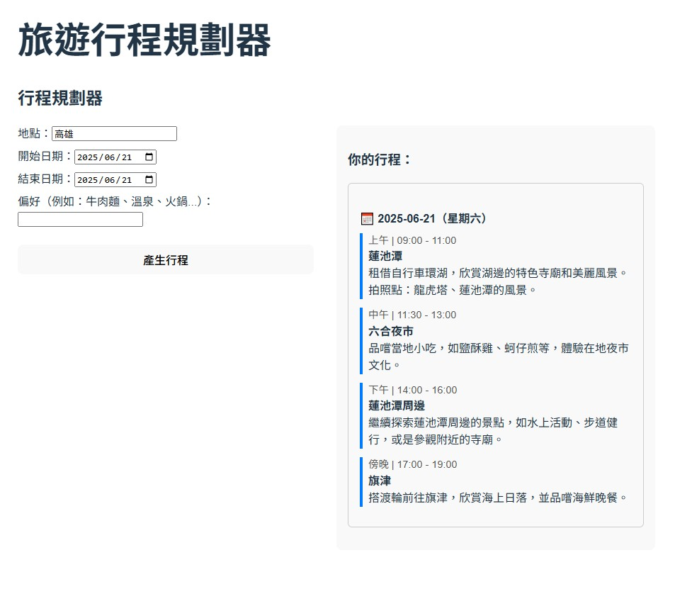

# Travel Planning Generator

This is a travel planning web application powered by OpenAI's GPT-4o-mini model.  
Users can input their desired location, travel dates, and preferences (such as food types or attractions), and the app generates a personalized travel itinerary using AI.

## ✨ Features

- Front-End : Vite + TypeScript  
- Backend : JavaScript  
- OpenAI Model : GPT-4o-mini

## ⚙️ Getting Started


```bash
1. Clone the Repository
	git clone https://github.com/Peienn/Travel-Planning-GeneratorTravel-Planning-Generator.git
	cd Travel-Planning-Generator

2. Configure Environment Variables
	find the server/.env file and add your OpenAI API key:your_openai_api_key_here

3. Run in your Docker
	docker-compose up --build 

```
## Sample


